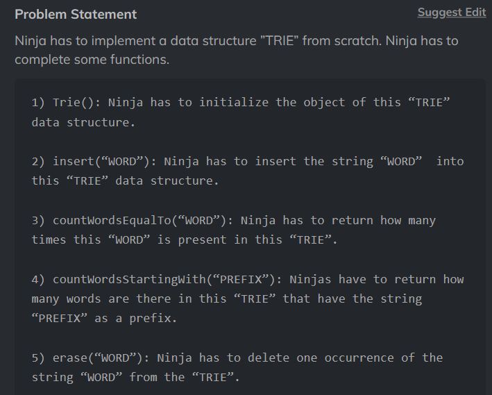

# Implement Trie


```md

Sample Input 1 :
5
1 hello
1 help
2 help
3 hel
2 hel 
Sample Output 1 :
true
true
false
 Explanation To Sample Input 1 :
Query 1: "hello" is inserted
Query 2: "help" is inserted
Query 3: "true" is printed as "help" is present
Query 4: "true" is printed as "hello" and "help" is present having the prefix "hel"
Query 5: "false" is printed as "hel" is not present

```
 

```cpp

/*
    Your Trie object will be instantiated and called as such:
    Trie* obj = new Trie();
    obj->insert(word);
    bool check2 = obj->search(word);
    bool check3 = obj->startsWith(prefix);
 */

/*
class Trie {

public:

    /** Initialize your data structure here. 
    
    Trie() {

    }

    /** Inserts a word into the trie. 
    void insert(string word) {

    }

    /** Returns if the word is in the trie. 
    bool search(string word) {

    }

    /** Returns if there is any word in the trie that starts with the given prefix. 
    bool startsWith(string prefix) {

    }
};

*/

#include <iostream>
#include <vector>

using namespace std;

class TrieNode {
public:
    vector<TrieNode*> children;
    bool isEndOfWord;

    TrieNode() {
        children.resize(26, nullptr);
        isEndOfWord = false;
    }
};

class Trie {
private:
    TrieNode* root;

public:
    /** Initialize your data structure here. */
    Trie() {
        root = new TrieNode();
    }

    /** Inserts a word into the trie. */
    void insert(string word) {
        TrieNode* curr = root;
        for (char ch : word) {
            int index = ch - 'a';
            if (curr->children[index] == nullptr) {
                curr->children[index] = new TrieNode();
            }
            curr = curr->children[index];
        }
        curr->isEndOfWord = true;
    }

    /** Returns if the word is in the trie. */
    bool search(string word) {
        TrieNode* curr = root;
        for (char ch : word) {
            int index = ch - 'a';
            if (curr->children[index] == nullptr) {
                return false;
            }
            curr = curr->children[index];
        }
        return curr->isEndOfWord;
    }

    /** Returns if there is any word in the trie that starts with the given prefix. */
    bool startsWith(string prefix) {
        TrieNode* curr = root;
        for (char ch : prefix) {
            int index = ch - 'a';
            if (curr->children[index] == nullptr) {
                return false;
            }
            curr = curr->children[index];
        }
        return true;
    }
};

```


# Implement Trie ll


```md



Sample Input 1:
1
5
insert coding
insert ninja
countWordsEqualTo coding
countWordsStartingWith nin
erase coding


Sample Output 1:
1
1 

```
 
```cpp

#include <bits/stdc++.h> 

/*
class Trie{

    public:

    Trie(){
        // Write your code here.
    }

    void insert(string &word){
        // Write your code here.
    }

    int countWordsEqualTo(string &word){
        // Write your code here.
    }

    int countWordsStartingWith(string &word){
        // Write your code here.
    }

    void erase(string &word){
        // Write your code here.
    }
};
*/


using namespace std;

class TrieNode {
public:
    TrieNode* children[26]; 
    // Array to store child nodes for each character ('a' to 'z')
    int wordCount; 
    // Number of words that end at this node
    
    TrieNode() {
        memset(children, 0, sizeof(children)); 
        // Initialize all child nodes to nullptr
        wordCount = 0; 
        // Initialize word count to 0
    }
};

class Trie {
private:
    TrieNode* root; 
    // Root node of the Trie
    
public:
    Trie() {
        root = new TrieNode(); 
        // Initialize the Trie with an empty root node
    }

    void insert(string& word) {
        TrieNode* curr = root;
        for (char c : word) {
            int index = c - 'a'; 
            // Compute the index of the character in the children array
            if (curr->children[index] == nullptr) {
                curr->children[index] = new TrieNode(); 
                // Create a new node if the character doesn't exist
            }
            curr = curr->children[index]; 
            // Move to the next node
        }
        curr->wordCount++; 
        // Increment the word count at the last node
    }

    int countWordsEqualTo(string& word) {
        TrieNode* curr = root;
        for (char c : word) {
            int index = c - 'a';
            if (curr->children[index] == nullptr) {
                return 0; 
                // Return 0 if the word doesn't exist
            }
            curr = curr->children[index];
        }
        return curr->wordCount; 
        // Return the word count at the last node
    }

    int countWordsStartingWith(string& prefix) {
        TrieNode* curr = root;
        for (char c : prefix) {
            int index = c - 'a';
            if (curr->children[index] == nullptr) {
                return 0; 
                // Return 0 if the prefix doesn't exist
            }
            curr = curr->children[index];
        }
        return countWords(curr); 
        // Recursively count words starting from the last node of the prefix
    }
    
    int countWords(TrieNode* node) {
        int count = node->wordCount;
        for (int i = 0; i < 26; i++) {
            if (node->children[i] != nullptr) {
                count += countWords(node->children[i]); 
                // Recursively count words in the subtree
            }
        }
        return count;
    }

    void erase(string& word) {
        TrieNode* curr = root;
        for (char c : word) {
            int index = c - 'a';
            if (curr->children[index] == nullptr) {
                return; 
                // Return if the word doesn't exist
            }
            curr = curr->children[index];
        }
        if (curr->wordCount > 0) {
            curr->wordCount--; 
            // Decrement the word count at the last node
        }
    }
};

```


# Longest String with All Prefixes 
# Complete String


```md

Sample Input 1 :
2
6
n ni nin ninj ninja ninga

2
ab bc


Sample Output 1 :
ninja
None


Explanation Of Sample Input 1 :
For test case 1 we have, 

All the prefixes of “ninja” -> “n”, “ni”, “nin”, “ninj” and “ninja” are present in array ‘A’. So, “ninja” is a valid answer whereas for “ninga” , the prefix “ning” is not present in array ‘A’.

So we output “ninja”.

For test case 2 we have, 

The prefixes of “ab” are “a” and “ab”. “a” is not present in array ‘A’. So, “ab” is not a valid answer.

The prefixes of “bc” are “b” and “bc”. “b” is not present in array ‘A’. So, “ab” is not a valid answer.

Since none of the strings is a valid answer we output “None”.

```
 
```cpp

#include <bits/stdc++.h> 

/*
string completeString(int n, vector<string> &a){
    // Write your code here.
}
*/


#include <vector>
#include <string>
using namespace std;

/*
O(N * M^2), where N is the number of strings in the array and M is the maximum length of a string in the array.
S-O(1)
*/
string completeString(int n, vector<string> &a) {
    int maxLen = 0; 
    // Stores the maximum length of a complete string found so far
    string result; 
    // Stores the lexicographically smallest complete string found so far

    for (const string &str : a) { 
        // Iterate through each string in the array
        int len = str.length(); 
        // Get the length of the current string
        bool isValid = true; 
        // Flag to check if the string is a complete string

        for (int i = 1; i <= len; i++) { 
            // Iterate through each prefix of the string
            string prefix = str.substr(0, i); 
            // Get the prefix of the current length

            // Check if the prefix exists in the array
            if (find(a.begin(), a.end(), prefix) == a.end()) {
                isValid = false; 
                // Prefix not found, string is not a complete string
                break; 
                // No need to continue checking prefixes
            }
        }

        // If the string is a complete string and has a longer length or is lexicographically smaller than the current result
        if (isValid && (len > maxLen || (len == maxLen && str < result))) {
            maxLen = len; 
            // Update the maximum length
            result = str; 
            // Update the result string
        }
    }

    if (maxLen == 0) {
        return "None"; 
        // No complete string found
    } else {
        return result; 
        // Return the longest complete string
    }
}

```

# Number Of Distinct Substring


```md

Sample Input 1 :
2
3
aaa
4
abab


Sample Output 1 :
3
7


Explanation For Sample Output 1 :
For the first test case :
Following are distinct substrings of the given string ‘WORD’.
“aaa”
“aa”   
“a”

For the second test case :
Following are distinct substrings of the given string ‘WORD’.
“abab”
“aba” 
“ab”
“a”
“bab”
“ba”
“b”

```
 
```cpp

#include <bits/stdc++.h> 

/*
int distinctSubstring(string &word) {
    //  Write your code here.
}
*/


/*

1. Initialize a set to store distinct substrings.
2. Iterate over the word and consider each character as the starting point of a substring.
3. For each starting character, iterate over the remaining characters to form all possible substrings.
4. Add each substring to the set.
5. Finally, return the size of the set, which represents the number of distinct substrings.

*/

int distinctSubstring(std::string &word) {
    std::set<std::string> substrings;  
    // Set to store distinct substrings
    int n = word.length();  
    // Length of the input word

    // Iterate over each character as the starting point of a substring
    for (int i = 0; i < n; i++) {
        std::string substring = "";  
        // Current substring
        for (int j = i; j < n; j++) {
            substring += word[j];  
            // Append current character to the substring
            substrings.insert(substring);  
            // Add the substring to the set
        }
    }

    return substrings.size();  
    // Return the number of distinct substrings
}


```

# Power Set (this is very important)


```md

Sample Input 1 :
3
1 2 3  


Sample Output 1 :
1
2
3
1 2
1 3
2 3

1 2 3 


Explanation Of Sample Input 1 :

The power set P(ARR) of set ARR = [1, 2, 3] is [ [], [1], [2], [1, 2], [3], [1, 3], [2, 3], [1, 2, 3] ].

```
 

```cpp


/*
#include <bits/stdc++.h> 
vector<vector<int>> pwset(vector<int>v)
{
    //Write your code here
}
*/


#include <bits/stdc++.h> 

using namespace std;


/*
    Time Complexity: O(N*(2^N))
    Space Complexity: O(N*(2^N))

    Where N is the number of elements in array
*/

vector<vector<int>> pwset(vector<int> arr) 
{
    int n = arr.size();

    // Create an array to store all subsets
    vector<vector<int>> ans;

    for (int i = 0; i <= pow(2, n); i++)
    {
        vector<int> temp;

        // Traverse through the array ARR
        for (int j = 0; j < n; j++) 
        {
            // Check if j-th bit is set
            if (i & (1 << j)) 
            {
                temp.push_back(arr[j]);
            }
        }

        // Insert the subset temp in ans
        ans.push_back(temp);
    }

    // Return the array ans
    return ans;
}


```

# Maximum XOR of Two Numbers in an Array


```md

Sample Input 1:
3
2 1 4


Sample Output 1:
6


Explanation For Sample Input 1:
Select the 1st and 3rd element leading to a xor value of 6.

```
 
```cpp

#include <bits/stdc++.h> 
/*
int maximumXor(vector<int> A)
{
    // Write your code here.   
}
*/


// Trie Node
struct TrieNode {
    TrieNode* children[2]; // Two children: 0 and 1
    TrieNode() {
        children[0] = nullptr;
        children[1] = nullptr;
    }
};

// Function to insert a number into the trie
void insertNumber(TrieNode* root, int number) {
    TrieNode* curr = root;
    
    // Traverse each bit of the number from left to right
    for (int i = 31; i >= 0; i--) {
        // Get the current bit
        int bit = (number >> i) & 1;
        
        // Create a new node if the current bit is not present
        if (curr->children[bit] == nullptr) {
            curr->children[bit] = new TrieNode();
        }
        
        // Move to the child node
        curr = curr->children[bit];
    }
}

// Function to find the maximum XOR value in the trie
int findMaxXOR(TrieNode* root, std::vector<int>& A) {
    int maxXOR = 0;
    
    // Traverse each number in the array
    for (int number : A) {
        TrieNode* curr = root;
        int currXOR = 0;
        
        // Traverse each bit of the number from left to right
        for (int i = 31; i >= 0; i--) {
            // Get the current bit
            int bit = (number >> i) & 1;
            
            // Check if the opposite bit is present in the trie
            if (curr->children[1 - bit] != nullptr) {
                currXOR |= (1 << i); // Update the current XOR value
                curr = curr->children[1 - bit]; // Move to the opposite bit node
            } else {
                curr = curr->children[bit]; // Move to the same bit node
            }
        }
        
        // Update the maximum XOR value
        maxXOR = std::max(maxXOR, currXOR);
    }
    
    return maxXOR;
}


// Function to calculate the maximum XOR value
int maximumXor(std::vector<int> A) {
    TrieNode* root = new TrieNode();
    
    // Insert each number into the trie
    for (int number : A) {
        insertNumber(root, number);
    }
    
    // Find the maximum XOR value in the trie
    int maxXOR = findMaxXOR(root, A);
    
    return maxXOR;
}


```
# Maximum XOR With an Element From Array


```md

Sample Input 1:
2
5 2
0 1 2 3 4
1 3
5 6
1 1
1
1 0  


Sample Output 1:
3 7
-1


Explanation Of Sample Input 1:
In the first test case, the answer of query [1, 3] is 3 because 1^2 = 3 and 2 <= 3,  and the answer of query [5, 6] is 7 because  5 ^ 2 = 7 and 2 <= 6.

In the second test case, no element is less than or equal to 0 in the given array ‘ARR’.

```
 
```cpp

/*
    Function to find the maximum XOR value of each query element with any array element 
    that is less than or equal to it.

    Time Complexity : O(N*M)
    Space Complexity : O(1)

    Where 'N' is the size of 'arr', and 'M' is the number of queries.
*/

vector<int> maxXorQueries(vector<int> &arr, vector<vector<int>> &queries) {
    // Size of the array and number of queries.
    int n = arr.size();
    int m = queries.size();

    // Create a result vector initialized with -1 to store the answer of each query.
    vector<int> result(m, -1);

    // Finding the answer for each query.
    for (int i = 0; i < m; i++) {
        for (int j = 0; j < n; j++) {
            // If the array element is less than or equal to the query's upper bound (queries[i][1]),
            // calculate the XOR value with the query's XOR value (queries[i][0]) and update the result.
            if (arr[j] <= queries[i][1]) {
                result[i] = max(result[i], arr[j] ^ queries[i][0]);
            }
        }
    }

    return result; // Return the vector containing the maximum XOR values for each query.
}


```

# Approach -2
```cpp

/*
    Time Complexity : O(N*(log(N)) + M*(log(M)))
    Space Complexity : O(N + M)

    Where 'N' is the size of ‘ARR’, and ‘M’  is the number of queries.
*/

#include <algorithm>

struct TrieNode {
    TrieNode *children[2];
};

void insert(TrieNode *root, int num) {
    TrieNode *ptr = root;

    for(int i = 30; i >= 0; i--) {
        if(num & (1 << i)) {
            if(ptr->children[1] == NULL) {
                ptr->children[1] = new TrieNode();
            }
            ptr = ptr->children[1];
        }
        else {
            if(ptr->children[0] == NULL) {
                ptr->children[0] = new TrieNode();
            }
            ptr = ptr->children[0];
        }
    }
}

vector<int> maxXorQueries(vector<int>& arr, vector<vector<int>>& queries)
{

    //  Size of array and number of queries.
    int n = arr.size();
    int m = queries.size();

    vector<int> result(m, -1), order(m);

    //  Sort ‘arr’ in non-decreasing order.
    sort(arr.begin(), arr.end());

    for(int i = 0; i < m; i++)
    {
        order[i] = i;
    }

    //  Order in which queries will be processed.
    sort(order.begin(), order.end(), [&](int i, int j) -> bool {
        return queries[i][1] < queries[j][1];
    });

    TrieNode *root = new TrieNode();
    int p = 0;

    //  Finding answer of each query.
    for(int i = 0; i < m; i++)
    {

        //  Index of query process in current iteration.
        int id = order[i];

        //  Insert integers of 'arr' smaller or equal to queries[id][1] in trie.
        while(p < n && arr[p] <= queries[id][1])
        {
            insert(root, arr[p]);
            p++;
        }

        //  If trie is empty then answer to this query is -1.
        if(root->children[0] == NULL && root->children[1] == NULL)
        {
            continue;
        }

        TrieNode *ptr = root;
        int ans = 0;

        for(int j = 30; j >= 0; j--)
        {

            // If jth bit is set in query[id][0].
            if(queries[id][0] & (1 << j))
            {
                if(ptr->children[0] != NULL)
                {
                    ptr = ptr->children[0];
                    ans = ans | (1 << j);
                }
                else
                {
                    ptr = ptr->children[1];
                }

            }
            else
            {

                // If jth bit is not set in query[id][0].
                if(ptr->children[1] != NULL) {
                    ptr = ptr->children[1];
                    ans = ans | (1 << j);
                } else {
                    ptr = ptr -> children[0];
                }
            }
        }

        result[id] = ans;

    }

    return result;
}


```

